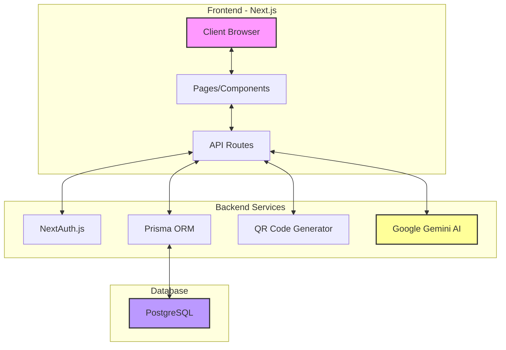
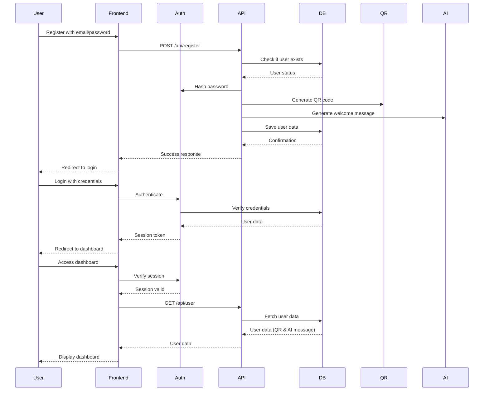
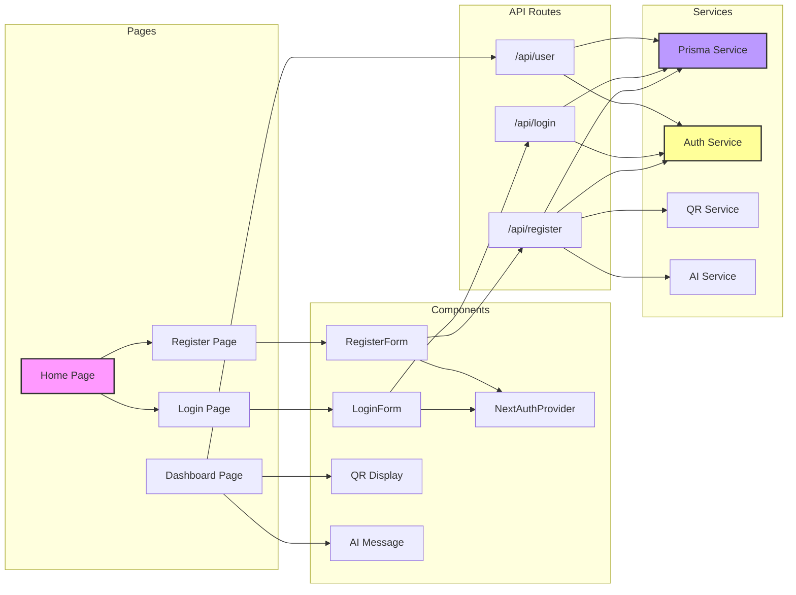
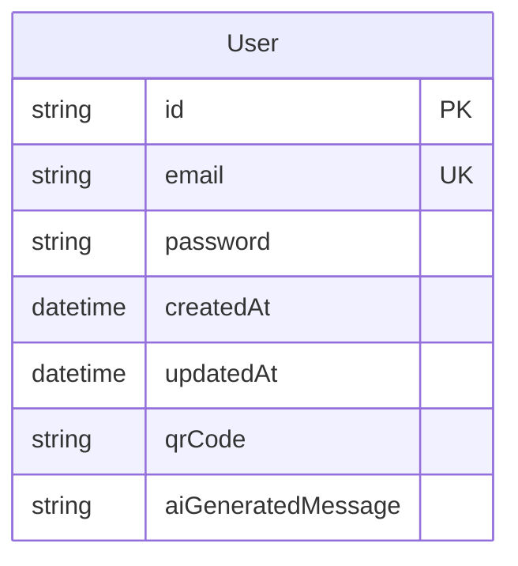

# System Architecture and Data Flow

## System Architecture Diagram

## Data Flow Diagram

## Component Architecture

## Database Schema

## Technical Stack Details

### Frontend
- Next.js 14 (React Framework)
- TailwindCSS (Styling)
- NextAuth.js (Authentication)

### Backend
- Next.js API Routes
- Prisma ORM
- QRCode Library
- Google Gemini AI

### Database
- PostgreSQL 15

### Security Features
- Password Hashing (bcrypt)
- JWT Session Tokens
- CSRF Protection
- Input Validation
- Secure Headers

## Data Flow Descriptions

### Registration Process
1. User submits registration form with email and password
2. Server validates input and checks for existing users
3. Password is hashed using bcrypt
4. QR code is generated based on user email
5. AI generates a personalized welcome message
6. User data is saved to PostgreSQL database
7. Success response redirects user to login

### Authentication Process
1. User submits login credentials
2. NextAuth.js verifies credentials against database
3. On success, JWT session token is generated
4. User is redirected to dashboard
5. Session token is used for subsequent requests

### Dashboard Data Retrieval
1. Client verifies active session
2. Requests user data from API
3. Server validates session token
4. Retrieves user data, QR code, and AI message
5. Returns data to client for display

## Security Considerations

1. **Authentication**
   - Secure password hashing
   - JWT token-based sessions
   - Protected API routes

2. **Data Protection**
   - Input validation
   - SQL injection prevention (Prisma)
   - XSS protection
   - CSRF tokens

3. **API Security**
   - Rate limiting
   - Request validation
   - Secure headers
   - Error handling

4. **Database Security**
   - Encrypted connections
   - Limited access permissions
   - Prepared statements 